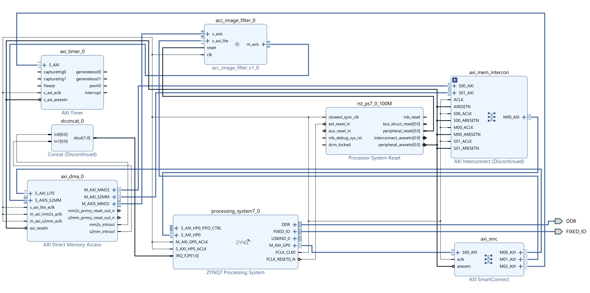

# FPGA Image Filter Accelerator

Hardware-accelerated spatial image filtering on the **Pynq-Z2** board (Zynq-7000 SoC), achieving up to **357× speedup** over ARM Cortex-A9 software processing.

Developed as a university project for the course *Digitalni VLSI Sistemi* (Digital VLSI Systems), 2025/26, Faculty of Electrical Engineering, University of Belgrade.

---

## Overview

This project implements a configurable **linear spatial image filter** accelerator in VHDL, supporting arbitrary filter kernels up to **9×9**. Pixels are streamed into the accelerator via AXI4-Stream from a DMA controller. The accelerator computes the weighted neighborhood sum for each pixel in a **fully pipelined** fashion — all multiplications across the kernel happen in parallel, giving **O(1) per-pixel throughput** regardless of kernel size.

The ARM Cortex-A9 processor configures the accelerator via AXI4-Lite registers, loads images into DDR memory, triggers DMA transfers, times both software and hardware runs, and verifies that the results match.

**Supported filter types** (all generated on-chip in C):
- Box (averaging) filter
- Gaussian blur
- LoG — Laplacian of Gaussian (edge detection)
- Sharpening based on box filter
- Sharpening based on Gaussian filter
- Sobel (gradient approximation via derivative of Gaussian)
- Prewitt (linear derivative)
- Bypass mode (pixel passthrough, no filtering)

---

## Repository Structure

```
image-filter-accelerator/
├── hardware/
│   └── src/
│       ├── acc_image_filter.vhd     # Top-level accelerator module
│       ├── ALU_filter.vhd           # 6-stage pipelined filter arithmetic unit
│       ├── RAM_line_buffer.vhd      # BRAM-based line buffer (column-packed words)
│       ├── my_types_PK.vhd          # Shared types: coeff_array_type, State_t FSM
│       └── RAM_definitions_PK.vhd   # clogb2() utility function for address width
├── block_design/
│   └── image_filter_design.bd       # Vivado block design (PS + DMA + Timer + acc)
├── software/
│   └── main.c                       # Bare-metal C app (Vitis): menu, filter gen, timing
├── scripts/
│   └── image_filter.ipynb  # Python notebook: image prep & result display
└── README.md
```

---

## System Architecture

### Vivado Block Design



The complete system is built around the ZYNQ7 Processing System and consists of the following IP blocks:

| Block | Role |
|---|---|
| **ZYNQ7 Processing System** | ARM Cortex-A9 host; runs `main.c`; connects to DDR and fixed I/O |
| **AXI DMA** (`axi_dma_0`) | Streams pixels from DDR to accelerator (MM2S) and receives results back (S2MM); both interrupt lines feed the PS via `xlconcat_0` |
| **acc_image_filter_v1_0** | Custom VHDL accelerator; receives 8-bit pixels on `s_axis`, sends 16-bit results on `m_axis`, configured via `s_axi_lite` |
| **AXI Timer** (`axi_timer_0`) | Hardware timer used to measure SW and HW execution time in µs |
| **AXI SmartConnect** (`axi_smc`) | Routes AXI4-Lite control buses from the PS GP0 port to the DMA, Timer, and accelerator |
| **AXI Interconnect** (`axi_mem_intercon`) | Connects the DMA's high-performance master ports to the PS HP0 port (DDR access) |
| **Processor System Reset** (`rst_ps7_0_100M`) | Generates synchronised resets for all PL peripherals |

### Data Flow

```
DDR (input image, uint8)
        │
        ▼  AXI4 HP0
  AXI Interconnect
        │
        ▼  AXI4
    AXI DMA  ──── MM2S ────► acc_image_filter  (8-bit AXI4-Stream)
                                    │
                             RAM_line_buffer   (single BRAM, 64-bit column words)
                                    │
                              ALU_filter       (6-stage fully pipelined MAC array)
                                    │
    AXI DMA  ◄─── S2MM ◄────────────           (16-bit AXI4-Stream results)
        │
        ▼  AXI4 HP0
  AXI Interconnect
        │
        ▼
DDR (output image, uint16)
```

The PS GP0 port controls all peripherals (DMA, Timer, accelerator registers) via the AXI SmartConnect using AXI4-Lite. DMA interrupts are concatenated by `xlconcat_0` and routed to the PS interrupt controller (`IRQ_F2P`).

---

## Hardware Modules

### `acc_image_filter.vhd` — Top-level module

Generics:
| Generic | Default | Description |
|---|---|---|
| `MAX_IMAGE_WIDTH` | 1024 | Maximum supported image width |
| `MAX_IMAGE_HEIGHT` | 512 | Maximum supported image height |
| `G_MAX_RADIUS` | 4 | Maximum filter radius (kernel up to 9×9) |

Three-state FSM (`St_Idle` → `St_Processing` → `St_Done`) controls data flow. On the first valid AXI-Stream pixel, parameters are latched from the AXI4-Lite registers into shadow registers — this ensures parameters cannot change mid-frame. A 1-entry pixel buffer (`buff_flag/buff_tdata`) handles the case where the input stream produces a pixel while the pipeline is not ready.

### `ALU_filter.vhd` — Pipelined arithmetic unit

A **6-stage fully pipelined** MAC array:

| Stage | Operation |
|---|---|
| 1 | Pixel counter latch (done in top-level) |
| 2 | 9×9 shift register update; new pixel into row 0, BRAM rows into rows 1–8 |
| 3 | 81 parallel multiplications: `pixel[r][c] × coeff[r][c]` (Q1.8 × Q1.15 → Q9.15) |
| 4 | 9 row partial sums (32-bit accumulator) |
| 5 | Total sum across all rows (32-bit) |
| 6 | Multiply by `coeff_scale`, clip, and format output |

Output modes (controlled by `MODE` bit in `reg_ctrl`):
- **Mode 0** — 8-bit unsigned (`uint8`): result clipped to [0, 255]
- **Mode 1** — 16-bit signed Q9.7 fixed-point: result clipped to [−32768, 32767]

Validity tracking: `alu_valid_pipe` propagates through all 6 stages. A pixel is marked invalid if its row or column counter is less than `2×FilterRadius`, matching the border-cropping requirement.

### `RAM_line_buffer.vhd` — BRAM line buffer

Uses a **single BRAM block** with 64-bit wide words (for max radius 4). Each memory address stores one full column of the line buffer — all 8 previously received rows for that column position, packed as bytes from MSB (oldest) to LSB (newest).

On each clock cycle:
1. **Read**: fetch the 64-bit word at the current column address
2. **Shift**: `new_word = {bram_rd_data[55:0], pixel_in}` — oldest row shifts out, newest pixel enters at LSB
3. **Write**: store `new_word` back to the same address

This eliminates the need for separate per-row BRAM blocks and efficiently uses a single 36Kb BRAM for images up to 512px wide (or a single 18Kb block for images up to 256px wide).

### `my_types_PK.vhd` — Shared types

Defines `coeff_array_type` (array of 81 16-bit coefficient registers) and `State_t` (the `St_Idle / St_Processing / St_Done / St_Wait` FSM type) shared across all modules.

### `RAM_definitions_PK.vhd` — Utility package

Provides `clogb2()` — ceiling log base 2 — used to compute the BRAM address bus width from the maximum image width generic.

---

## Software Application (`main.c`)

Interactive bare-metal C application running on the ARM Cortex-A9. On each loop iteration:

1. **User selects** filter type and parameters (radius, sigma, k, axis, output mode) via UART
2. **Coefficients are generated on-chip** using floating-point math — no pre-computed tables needed:
   - `CalculateScaleAndQuantize()` automatically finds the optimal `CoeffScale` by scaling the largest coefficient to ~0.95 of the Q1.15 range, minimizing quantization error
3. **User loads the image** into DDR via the XDB `mwr` command; the app prints the exact command with the correct address and byte count
4. **Accelerator is configured** via `AccConfigure()` — writes all 86 registers and read-back-verifies each one
5. **Software reference run** (`FilterImageSW`) is timed with AXI Timer → stored in `ReferentBuffer`
6. **Hardware run** (`FilterImageHW`) is timed — DMA transfers input plane(s) to the accelerator and receives results into `ResultBuffer`
7. **Verification** (`CheckData`) compares every pixel between HW and SW results; reports first 15 mismatches if any
8. **User saves outputs** from DDR via the XDB `mrd` command; the app prints the exact commands for both the HW result and SW reference

Multi-plane (RGB) images are supported — each plane is processed independently as a separate DMA transfer.

---

## Accelerator Register Map

All registers are 16-bit wide, accessed as 32-bit AXI4-Lite words (2 LSBs of address unused).

| Address | Register | Description |
|---|---|---|
| `0x00` | `reg_ctrl` | `[0]` MODE: 0=uint8, 1=Q9.7 · `[1]` BYPASS · `[3:2]` BORD · `[11:4]` BORDER_VALUE |
| `0x04` | `reg_radius` | Filter radius [0–4]; kernel = (2·radius+1)² |
| `0x08` | `reg_img_w` | Input image width |
| `0x0C` | `reg_img_h` | Input image height |
| `0x10` | `reg_coeff_scale` | Scale factor, UQ4.12 unsigned fixed-point |
| `0x14` | `reg_coeff_W0` | Coefficient W0, Q1.15 signed fixed-point |
| `0x18` | `reg_coeff_W1` | Coefficient W1 |
| … | … | … |
| `0x150` | `reg_coeff_W80` | Coefficient W80 |

---

## Coefficient Encoding

Filter coefficients use **Q1.15 signed fixed-point** (range: [−1, +0.99997]):
```
register_value = round(coefficient × 2¹⁵)
```

The scale factor uses **UQ4.12 unsigned fixed-point** (range: [0, ~15.999]):
```
scale_register = round(scale × 2¹²)
```

`CalculateScaleAndQuantize()` handles this automatically: it finds the maximum absolute coefficient, scales all coefficients so the largest maps to ~0.95 in Q1.15, and computes the corresponding inverse scale factor for the hardware output stage.

---

## Performance Results

Measured using the on-chip AXI Timer (filtering operation only). All tests on Pynq-Z2.

| Image | Filter | SW Time [µs] | HW Time [µs] | Speedup |
|---|---|---|---|---|
| lena_128 | Box 5×5 | 42,651 | 406 | **105×** |
| lena_128 | Gaussian 9×9 | 120,304 | 397 | **303×** |
| lena_512 | LoG 7×7 | 1,315,591 | 5,935 | **222×** |
| lena_512 | Gaussian 9×9 | 2,122,011 | 5,939 | **357×** |
| parrots | Sharpening 7×7 | 5,943,419 | 26,743 | **222×** |

The HW time is **independent of kernel size** — Gaussian 9×9 and LoG 7×7 on the same image take essentially the same time (~5.9 ms), because all 81 multiplications execute in parallel within a single pipeline stage. Software time scales as O(N²) with kernel width.

---

## Getting Started

### Prerequisites

- Xilinx Vivado 2020.x+ for hardware synthesis
- Vitis / Xilinx SDK for the C bare-metal application
- Pynq-Z2 board
- Python 3 with `numpy`, `matplotlib` for the notebook

### Build & Deploy

1. Open Vivado → create a new project → add all `.vhd` files from `hardware/src/`
2. Open the block design: `block_design/image_filter_design.bd`
3. Run Synthesis → Implementation → Generate Bitstream
4. Export hardware (`.xsa`) → open in Vitis
5. Create a bare-metal application project, add `software/main.c`
6. Build and program the board via JTAG

### Image Workflow

Use `scripts/image_filter.ipynb` to:
- Load any image, convert to grayscale or RGB, and resize it
- Export as a raw `uint8` binary `.bin` file
- Transfer to the board: `mwr -size b -bin -file image.bin <addr> <size>`
- After processing, read back: `mrd -size h -bin -file output.bin <addr> <count>`
- Display and compare SW and HW filtered results side by side

---

## Output Image Size

Border pixels with incomplete neighborhoods are not computed. The output is smaller than the input by `2×FilterRadius` in each dimension:

```
output_width  = input_width  − 2 × FilterRadius
output_height = input_height − 2 × FilterRadius
```

---

## Authors

Developed by my friend and I as part of the *Digitalni VLSI Sistemi* course, 2025/26.  
Faculty of Electrical Engineering, University of Belgrade.

---

## License

This project is licensed under the MIT License.
